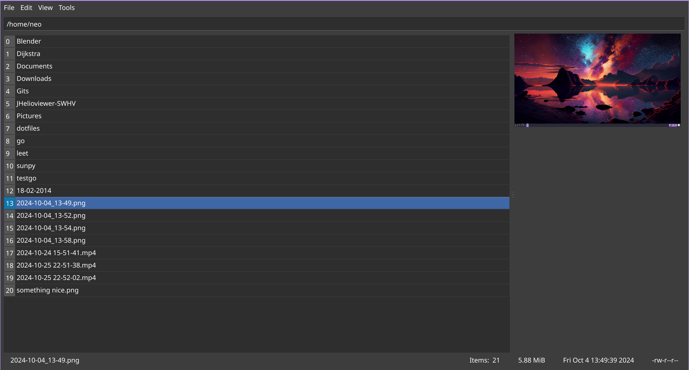

# Table of Contents

1.  [Introduction](#orgad64bb1)
2.  [Why another file manager ?](#org326bc2f)
3.  [Features](#org667977f)
4.  [TODOs](#org2eefded)
5.  [Wiki](#orgb2dd5a8)

A file manager for the minimalist & impatient

# Introduction

This is a file manager written using the Qt GUI framework leveraging the performance and robustness of C++.

# Why another file manager ?

The file managers for linux aren’t that great for me. So I decided to write my own. And this one is inspired by the TUI (terminal UI) keyboard driven file managers like ranger, vifm, lf, yazi etc. I still use them, but I wanted to get past the limitations of the TUI compared to the GUI.

# Features

1.  Display Images
2.  Async File Operations
3.  Keyboard driven
4.  [Bookmarks](./wiki.org#bookmarks)
5.  [Scoped Commands](./wiki.org#types-of-command)
6.  Shell Command Executions
7.  [Linux Only](./wiki.org#linux-only)
8.  Drag and Drop
9.  [Configuration with Lua](./wiki.org#lua-configuration)
10. [Scripting with Lua](./wiki.org#scripting-with-lua)

# Screenshots
# TODOs

Please refer to [this file](./TODO.md)

# Wiki

Please refer to [this file](./wiki.md)
