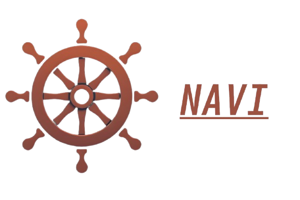

====================
Navi Documentation
====================

Welcome to the documentation for Navi. This documentation is for version |version|.

Navi is a minimalist and efficient file manager designed for users who value speed and simplicity. Developed using the Qt framework in C++, Navi offers a keyboard-driven interface inspired by terminal-based file managers like Ranger and Vifm, while leveraging the enhanced capabilities of a graphical user interface.

`Project Github <https://github.com/dheerajshenoy/navi>`_

`Project Website <https://dheerajshenoy.github.io/navi>`_

Key Features:

    + **Performance-Oriented**: Built with C++ and Qt for optimal speed and responsiveness.

    + **Keyboard-Centric Navigation**: Navigate and manage files swiftly using intuitive keyboard shortcuts.

    + **Customizable**: Tailor the software to suit your workflow preferences.

    + **Extensibility**: Supports plugins and scripts for added functionality.

Navi is ideal for users seeking a streamlined file management experience without the overhead of more complex applications. Its design philosophy centers on delivering essential features with maximum efficiency, making it a suitable choice for both beginners and advanced users.

.. toctree::
    :caption: Getting Started
    :hidden:

    installation.rst
    getting_started.rst
    lua_scripting.rst
    api.rst
    gallery.rst
    changelog.rst

Acknowledgement
===============

Navi uses the following header-only C++ libraries. Thanks to the authors of the following libraries:

- `ArgParse <https://github.com/p-ranav/argparse>`_ (for parsing command line arguments)
- `Sol2 <https://github.com/ThePhD/sol2>`_ (for lua integration)
