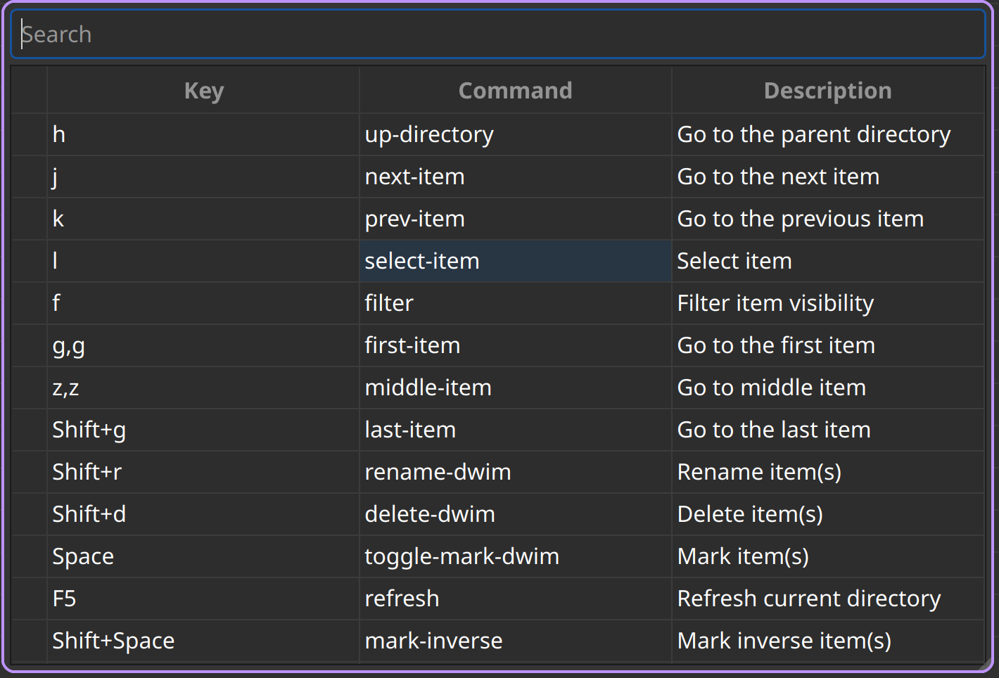

# Table of Contents
<!-- markdown-toc start - Don't edit this section. Run M-x markdown-toc-refresh-toc -->

- [Table of Contents](#table-of-contents)
- [Installation](#installation)
- [Using Navi](#using-navi)
    - [Naming Conventions](#naming-conventions)
    - [Bookmarks](#bookmarks)
    - [Interactive Commands](#interactive-commands)
        - [Types of Command](#types-of-command)
            - [Current Scope](#current-scope)
            - [Local Scope](#local-scope)
            - [Global Scope](#global-scope)
            - [DWIM](#dwim)
    - [Commands List](#commands-list)
        - [Navigation](#navigation)
        - [Echo (Printing) Commands](#echo-printing-commands)
        - [Marking Item](#marking-item)
        - [Unmarking Item](#unmarking-item)
        - [Selecting Item](#selecting-item)
        - [Change Permission](#change-permission)
        - [Renaming Files](#renaming-files)
            - [Bulk Rename](#bulk-rename)
        - [Cutting Files](#cutting-files)
        - [Copying Files](#copying-files)
        - [Pasting (Moving) Files](#pasting-moving-files)
        - [Deleting Files](#deleting-files)
        - [Trashing Files](#trashing-files)
        - [Filtering Items](#filtering-items)
        - [Panes](#panes)
        - [Misc](#misc)
        - [Shell Commands](#shell-commands)
        - [Macro](#macro)
    - [Tutorial](#tutorial)
- [Linux Only](#linux-only)
- [Theming](#theming)
- [Scripting with Lua [scripting-with-lua]](#scripting-with-lua-scripting-with-lua)
    - [Special Function](#special-function)
    - [Custom functions](#custom-functions)
    - [Hooks](#hooks)
        - [Hook Names](#hook-names)
    - [Navi Lua API](#navi-lua-api)
        - [UI](#ui)
        - [API](#api)
        - [IO](#io)
        - [Shell](#shell)
    - [What can you do with scripting ?](#what-can-you-do-with-scripting-)
        - [Setting wallpaper](#setting-wallpaper)
- [Configuration with Lua](#configuration-with-lua)
- [Acknowledgement](#acknowledgement)

<!-- markdown-toc end -->

# Installation

Navi can be built from source. The following libraries are dependencies
for navi:

- [Qt6](https://www.qt.io/product/qt6)
- [Lua](https://www.lua.org/start.html)
- [ImageMagick(Magick++)](https://imagemagick.org/script/magick++.php)
- [Poppler (Poppler-Qt6)](https://poppler.freedesktop.org/api/qt6/)
- [Udisks](https://www.freedesktop.org/wiki/Software/udisks/)
- [TreeSitter](https://tree-sitter.github.io/tree-sitter/)

If you're on ArchLinux you can copy paste the following `pacman` code to
install these dependencies:

``` bash
sudo pacman -S qt6-base lua imagemagick poppler poppler-qt6 udisks2 tree-sitter tree-sitter-query tree-sitter-c tree-sitter-markdown tree-sitter-python tree-sitter-lua tree-sitter-bash tree-sitter-javascript
```

If you're on Ubuntu/Debian based distribution, you can paste the
following `apt` code to install the dependencies:

``` bash
sudo apt install qt6-base-dev lua5.4 libmagick++-dev libpoppler-dev libpoppler-cpp-dev libpoppler-qt6-dev udisks2 libtree-sitter-dev
```

**NOTE**: I have not tested Navi on an Ubuntu machine. If there are any
problems, please open an issue.

After installing these dependencies on your system and cloning this
project repository, you can build navi by using the following command
(inside the project’s directory):

``` bash
mkdir build && cd build
cmake -DCMAKE_BUILD_TYPE=Release ..
make -j$(nproc)
sudo make install
```

One liner:
```bash
mkdir build && cd build && cmake -DCMAKE_BUILD_TYPE=Release .. && make -j $(nproc) && sudo make install
```

# Using Navi
## Naming Conventions

1.  `Item` refers to a file or a directory.

2.  `Highlighting` refers to the action of clicking a directory item
(one or more than one) once. This means that you can use your mouse
to select and highlight multiple items in the directory.

3.  `Marking` refers to the action of the `mark` or `toggle-mark`
command to "select" one or more currently highlighted directory
items. You can see the list of all the files that you have marked in
the `Marks List` using `View -> Marks List` or by using the
`show-marks` command. When you call any of the commands, the
commands will be aware of these markings and do the action
accordingly. For example, if we use the `rename` command and if
there are marked files, your choice of text editor is opened with
the list of all the file names. You can change these and write to
the file to rename them accordingly.

## Bookmarks

Bookmarks allows you to instantly go to your favourite or frequently
visited directories. You can add, edit, remove and load bookmarks from a special bookmarks file `bookmark.lua` which should be stored in config directory where the `config.lua` file exists. Bookmark file has the following structure:

```lua
BOOKMARKS = {
    bookmarkName1 = {
        path = "bookmarkPath1",
    },

    bookmarkName2 = {
        path = "bookmarkPath2",
        highlight_only = true,
    }
}
```

The `highlight_only` key tells Navi not to go into the directory bookmarkPath2, instead just go the directory containing that file and just put the cursor (or highlight) the item pointed by the location.

**NOTE: When navi startsup, it checks for the `bookmark.lua` file and loads it if it exists.**

### Go to bookmark

Once bookmarks are loaded, you can use the command `bookmark-go` and provide a bookmark name as argument to it (or it asks for the bookmark name if you do not give the argument) and if the name exists, it takes you to the path associated with that bookmark name.

### Edit bookmark

#### Name

You can use the command `bookmark-edit-name` to edit the name of the bookmark which exists.

#### Filepath

You can use the command `bookmark-edit-path` to edit the path pointed to an item associated with a bookmark name.

### Add bookmark

You can add new bookmarks directly to the `bookmark.lua` file BOOKMARKS table. Or, you can add bookmarks interactively from within Navi. You can visit any directory you want to bookmark, and then once you are there, just call `bookmark-add` followed by the name of the bookmark as argument (or it asks for the bookmark name if no argument is provided).

**NOTE: The bookmark names have to be unique, and therefore navi errors out if you provide the same bookmark name that already exists in the bookmarks file**

### Save bookmark

Once you add bookmarks from within navi, you can save the changes by calling `bookmarks-save` to write the bookmarks to the `bookmark.lua` file.

## Interactive Commands

These are commands that can be executed using the `inputbar` UI component. By default, pressing `: (colon)` key pops up the inputbar. You can type a name of the command in this bar or a line number to go to in the current directory of the focused pane. Example: `mark` or `42`, where `mark` would mark the current item under focus or highlighted items (more than one items).

### Types of Command

There are four variants for most of the commands: `Current`, `Local`, `Global` and `DWIM` (Do What I Mean).

#### Current Scope

This applies to the currently selected item. Any command that is `Current` scoped will run only on the currently highlighted item.

**This includes mouse selection (also called as Highlighting)**.

#### Local Scope

This applies to the marks that are in the current directory which is conveniently called as a **Local Mark**. Any command that is `Local` scoped will run on the local marks.

**This does not include mouse highlighting.**

#### Global Scope

This applies to the marks that are present in any directory. Unlike the `Local` scope the command that is `Global` scoped will run on the marks that are present in any directory.

**This does not include mouse highlighting**.

#### DWIM

[DWIM wikipedia page](https://en.wikipedia.org/wiki/DWIM)

Do What I Mean version of commands. If no local marks are present, run the command on the current item, otherwise run the commands on the marks.

## Commands List

Below is an exhaustive list of commands that are currently available in Navi.

### Navigation

`next-item`

Go to the next item

`prev-item`

Go to the previous item

`select-item`

Select the current item

`middle-item`

Go to the middle item

`up-directory`

Go to the parent directory

`first-item`

Go to the first item

`last-item`

Go to the last item

### Echo (Printing) Commands

`echo-info`

Echos or prints the information given as argument with the *info-face* font

`echo-warn`

Echos or prints the information given as argument with the *warning-face* font

`echo-error`

Echos or prints the information given as argument with the *error-face* font

### Marking Item

`mark`

Marks the current item.

`toggle-mark`

Toggle the mark of the current item.

`toggle-mark-dwim`

DWIM version of `toggle-mark` command

`mark-all`

Marks all the items in the current directory.

`mark-inverse`

Inverses the marks in the current directory.

`mark-dwim`

DWIM version of `toggle-mark`

### Unmarking Item

`unmark`

Unmarks the current item.

`unmark-local`

Unmarks **Local Marks**

`unmark-global`

Unmarks **Global Marks**

### Selecting Item

`visual-select`

Enters into *visual selection* mode. Navigation is followed by selection until the mode is toggled off.

### Change Permission

`chmod`

Change the permission of the current item using three digit numbers

Example: 777, 666, 000 etc.

`chmod-local`

Change permission for **Local Marks**

`chmod-global`

Change permission for **Global Marks**

`chmod-dwim`

Change permission **DWIM** style

### Renaming Files

**NOTE: Renaming more than `bulk-rename-threshold` (configuration option) which is by default 5 will trigger a **[Bulk Rename](#bulk-rename)** process.

`rename`

Rename the highlighted item.

`rename-local`

Renames items in the **Local Marks**

`rename-global`

Renames items in the **Global Marks**

`rename-dwim`

Renames items in **DWIM** style

#### Bulk Rename

This is where a text editor of your choice (set it in the configuration) opens up a temporary "rename file" and enables you to rename all the marked files once you save and close the said "rename file". By default navi uses the `neovim` text editor.

### Cutting Files

`cut`

Cut (prepare for moving) the current item.

`cut-local`

Register cut for **Local Marks**

`cut-global`

Register cut for **Global Marks**

`cut-dwim`

Register cut in **DWIM** style

### Copying Files

`copy`

Copy the current item.

`copy-local`

Register copy for **Local Marks**

`copy-global`

Register copy for **Global Marks**

`copy-dwim`

Register copy in **DWIM** style

### Pasting (Moving) Files

`paste`

Paste (Move) the current item.

### Deleting Files

**WARNING: Please be careful when using delete commands, this does not trash the items, it directly deletes them. If you want to trash use the *trash* command**

`delete`

Delete the highlighted items(s).


`delete-local`

Deletes items in the **Local Marks**

`delete-global`

Deletes items in the **Global Marks**

`delete-dwim`

Deletes items in **DWIM** style

### Trashing Files

`trash`

Trash the current item.

`trash-local`

Trashes items in **Local Marks**

`trash-global`

Trashes items in **Global Marks**

`trash-dwim`

Trashes items in **DWIM** style

### Filtering Items

`filter`

Set a filter to directory.

Example: `*` displays everything, `*.csv` displays only the csv files, `*.png` displays only the png files

`reset-filter`

Reset the appplied filter.

`hidden-files`

Toggles the hidden files.

**NOTE**: Hidden files are those items whose name start with a period like `.config`, `.gitignore` etc.

`dot-dot`

Toggles the .. file item.

### Panes

`bookmark-pane`

Opens the bookmarks list.

TODO: work in progress

`marks-pane`

Opens the marks list.


`messages-pane`

Opens the messages list.


`preview-pane`

Toggles the preview pane.

The preview pane handles previewing images (good number of formats) and PDF documents (first page) `asynchronously`. This means that the previewing experience will be seamless and without any lag. Navi uses `ImageMagick` library under the hood for previewing images and therefore any image formats supported my ImageMagick is supported by Navi.

`shortcuts-pane`

This displays the list of all the shortcuts.




### Misc

`fullscreen`

Toggle fullscreen mode for Navi.

`execute-extended-command`

This is the function that pops up the inputbar to enter the interactive commands.

`menu-bar`

Toggles the menu bar.

`focus-path`

Focuses the path widget and sets it in edit mode.

`item-property`

Display the property of the currently focused item.

`header`

Toggle the display of header information.

`cycle`

Toggle the cycle (last item to first item and vice-versa) during navigation.

`refresh`

Force refresh the current directory.

`syntax-highlight`

Toggle the syntax highlight for text preview

**NOTE: By default, Navi watches the directory for changes and loads them, so there is no requirement to refresh the directory. This command is there just in case something does not look right.**

`mouse-scroll`

Toggle mouse scroll support for file panel

`reload-config`

Re-reads the configuration file if it exists and loads the configurations.

`tasks`

Opens the task widget showing all the running tasks like command execution with outputs and file operations like copying, moving and deleting/trashing.

https://github.com/user-attachments/assets/7cc31950-3cd1-4d2b-a244-b6ba6cdcd32a

`cd`

Change directory with the provided argument or ask for input.

`folder-property`

Get the property of the currently open folder

`copy-path`

Copy the path(s) of the currently "highlighted" (not to be confused with marked) files.

You can pass an optional argument which will be the separator that separates the paths of all the selected files.

**NOTE: You can configure the default separator in the config using the `copy_path_separator` variable**

`exit`

Exits Navi

`new-window`

Creates a new instance of navi

### Shell Commands

`shell`

Run a shell command *asynchronously* (non-blocking).

The running commands can be seen in the `Task Widget` using the `tasks` command

### Macro

Macros allow you to record actions performed inside Navi and save it, which you can then recall it to perform the action over and over again.

`macro-record`

This records / finishes recording (if already recording) a macro under a _macro key_. Macro key is a string identifier under which the macro has to be recorded. It can be any random string that you can remember to recall it when you want to play the macro.

`macro-play`

This plays a macro under a specific macro key.

`macro-edit`

Opens macro commands recorded under a specific macro key (if it exists) with your editor to edit, which will then be saved and can be recalled.

`macro-list`

Lists all the macros that have been defined.

`macro-save-to-file`

Saves macro to a file which can be used to load for the next boot of Navi.

`macro-delete`

Delete macro under a macro key (if it exists).


## Tutorial

Using navi is easy. You have bunch of commands that do certain things and sometimes they depend on the context (see DWIM commands). The default settings are set up for you to use navi without any configurations needed. The default keybindings are listed below:

* `h` to go to the parent directory
* `j` to go the next item
* `k` to go the previous item
* `l` to select the current item
* `gg` to go to the first item
* `Shift+g` to go the last item
* `Space` to toggle marking for the current item
* `Shift+Space` to toggle inverse marking for the current directory
* `Ctrl+a` to mark all the items in the current directory
* `Shift+r` to rename current item if no marks are present or all the marked items if marks are present (this is what DWIM means)
* `Shift+d` to delete DWIM
* `yy` to copy DWIM
* `p` to paste cut/copy marked items to the current directory
* `Shift+u` to unmark all the local marks
* `.` toggle hidden/dot files
* `/` Search for item in the current directory
* `n` Go to the next match for the search
* `Shift+n` Go to the previous match for the search
* `Ctrl+m` toggle menubar
* `Ctrl+p` toggle preview panel
* `Ctrl+l` focus the path widget
* `Shift+v` Toggle visual line selection mode

**NOTE: These keybindings are not loaded if there is a `keybindings` table in the lua configuration file**

# Linux Only

Sorry, this software is built keeping in mind Linux and it's derivatives only.

# Theming

Since navi is a Qt GUI library based application, it can be styled using the `qt6ct` package available on linux. The colors mentioned in the configuration file will override the respective control colors of the theme.

# Scripting with Lua [scripting-with-lua]

Navi can be scripted to include custom actions by subscribing to hooks and perform custom actions in response to those  hooks.

## Special Function

The function `INIT_NAVI` will be called during the startup time of Navi. This function can be used to add hooks and whatnot to your configuration.

```lua
function INIT_NAVI()
    navi.io.msg("Navi just booted")
end
```

## Custom functions

You can write custom functions in lua with arguments. Navi passes the current file name and directory name to each of these functions when they are called. You can then proceed to process the file from within lua using Navi.

```lua
function someFunction(fileName, dirName)
    navi.io.msg("WOW! Navi is currently on the file " .. fileName .. " and inside the " .. dirName .. " directory!")
end
```

You can then call this function within Navi by calling the `lua <function_name>` command or by just calling `lua` command and then typing in the function name in the inputbar. Doing this will execute the function. The function in the example above when executed will display:

"WOW! Navi is currently on the file `<fileName>` and inside the `<dirName>` directory!"

## Hooks

Hooks are signals that are emitted when navi does a certain action which you can "subscribe" to to create a custom action associated with that signal. Hooks are emitted for actions like selecting an item, changing directory etc.

You can add hook using the `navi.hook.add` api. It takes two arguments, both of which are required. The first one is a `hook_name` which is a valid hook name (see hook names below). Second argument is a function that will be executed in response to the hook.

Hook functions can be of any number. But keep in mind that, after emitting the hook, Navi executes each of these functions (if there are multiple), so it's best to add functions that are efficient.

### Hook Names

* Select Item `item_select`
* Item Changed `item_changed`
* Up Directory `directory_up`
* Directory Loaded `directory_loaded`
* Directory Changed `directory_changed`
* Drive Mounted `drive_mounted`
* Drive Unmounted `drive_unmounted`
* Visual Line mode `visual_line_mode_on` & `visual_line_mode_off`
* Filter mode `filter_mode_on` & `filter_mode_off`

Example:

```lua
function INIT_NAVI()
    navi.hook.add("item\_select", function ()
        navi.io.msg("You selected an item...YAY!")
    end)
end
```

Now, whenever you select (open or enter a directory) an item, you'll get the message, "You selected an item...YAY!".

## Navi Lua API

API or Application Programming Interface allows user to customize the behaviour or add extra functionalities to Navi.

There is a main `navi` table. In this table are *four* more tables: `ui`, `api`, `io` and `shell`.

### UI

#### marks
#### shortcuts
#### messages
#### preview_panel
#### pathbar
#### statusbar
#### `menubar` (table)

##### `toggle` (void)

Toggles the menubar

##### `toggle` _arg: bool_ (void)

Toggles the menubar with the _arg_ state

##### `add_menu` _arg: MenuItem_ (void)

Adds the menu provided as argument to the menubar.

The argument should have the structure of `MenuItem` type.

```cpp
MenuItem {
    label = "menu label",
    submenu = {
        label = "submenu",
        action = function ()
    }
}
```

Check the following example for reference:

```lua
function INIT_NAVI()
    -- This is a function with special meaning to Navi.
    -- This will be called on startup

    custom_menu = {
        label = "Custom Menu",
        submenu = {
            {
                label = "Open",
                action = function()
                    navi.io.msg("HELLO WORLD");
                end,
            },

            {
                label = "sub",
                submenu = {
                    {
                        label = "item 1",
                        action = function ()
                            navi.io.msg("SUB HELLO");
                        end
                    }
                },
            },

            {
                label = "Save",
                action = function() print("Save clicked") end,
            }
        }
    }

    navi.ui.menubar.add_menu(custom_menu)

end
```


### API

+ sort\_name
+ `search` (void)

Search for the text string given as argument.

+ search\_next
+ search\_prev
+ new\_files
+ new\_folder
+ trash
+ copy
+ copy\_dwim
+ cut\_dwim
+ cut

+ `has\_marks\_local` (bool)

Returns `true` if there are local marks, else `false`

+ `has\_marks\_global` (bool)

Returns `true` if there are global marks, else `false`

+ `global\_marks` (table)

Returns the list of global marks

+ `local\_marks\_count` (int)

Returns the count of local marks

+ `global\_marks\_count` (int)

Returns the count of global marks

+ `local_marks` (table)

Returns the list of local marks in the current working directory

+ `highlight` (void)

Highlights the item with the name passed as argument if it exists.

+ `cd` (void)

Change the current working directory to the string provided as argument.

+ `pwd` (str)

Returns the string of the current working directory.

### IO

+ `msg`
+ `msgtype`. This is an enum with the following members:
    + `error`
    + `warning`
    + `info`
+ `input`

### Shell

+ `execute`

You can execute any shell commands from within navi.

## What can you do with scripting ?

### Setting wallpaper

```lua
function setWallpaper()
    navi.shell("xwallpaper --stretch" .. filename)
end
```

### Open a terminal at the current directory

```lua
function terminalAtPoint()
    local terminal = os.getenv("TERMINAL")
    local dir = navi.api.pwd()
    navi.spawn(terminal, { dir })
end
```

### Using `fd` to navigate to directory with matching name

*NOTE: Use the following helper function if you want the `fd` and `rg` code to run correctly*
```lua
-- Helper function that returns the STDOUT of a command `commandString`
function command(commandString)
    local command = commandString
    local handle = io.popen(command)
    local result = handle:read("*a")
    handle:close()
    return result:gsub('[\n\r]', '')
end
```

```lua
-- Use `fd` to go to the best file match having the name given as the input
function fd()
    local input = navi.io.input("Search (FD)")
    if input ~= "" then
        local pwd = navi.api.pwd()
        local commandString = string.format("fd %s %s --type=directory | head -n 1", input, pwd)
        local result = command(commandString)
        if result ~= "" then
            navi.api.cd(result)
        else
            navi.io.msg("No results", navi.io.messagetype.warn)
        end
    end
end
```

### Use `rg` (ripgrep) command to navigate to a directory with the matching content

```lua
-- Use `ripgrep` to go to the file content with the name given as the input
function rg()
    local input = navi.io.input("Search (RG)")
    if input ~= "" then
        local pwd = navi.api.pwd()
        local commandString = string.format("rg %s %s -l --sort-files | head -n 1", input, pwd)
        local result = command(commandString)
        if result ~= "" then
            navi.api.cd(result)
            navi.api.highlight(result)
        else
            navi.io.msg("No results", navi.io.messagetype.warn)
        end
    end
end
```

### Use `zoxide` for faster navigation

```lua
function zoxide()
    local input = navi.io.input("Zoxide CD")
    if input ~= "" then
        local commandString = string.format("zoxide %s", input)
        local result = command(commandString)
        if result ~= "" then
            navi.api.cd(result)
        else
            navi.io.msg("No results", navi.io.messagetype.warn)
        end
    end
end
```

*NOTE: You could also use the `navi.shell.execute` api to execute the commands. But because this functionality exists in Lua, we use it.*

### Go to a random directory inside your home directory

```lua
function randomDirectory()
    local commandString = "fd . ~ -t d | shuf -n 1"
    local result = command(commandString)
    if result ~= "" then
        navi.api.cd(result)
    end
end
```

### Highlight a random file inside your home directory

```lua
function randomFile()
    local commandString = "fd . ~ | shuf -n 1"
    local result = command(commandString)
    if result ~= "" then
        navi.api.cd(result)
        navi.api.highlight(result)
    end
end
```

# Configuration with Lua

Navi can be configured using lua. The default configuration file is provided in this git repository. Navi looks for the configuration file in the XDG standard config directory (`~/.config`). You can place your configuration file in the `~/.config/navi/` directory. The configuration file should be named `config.lua`.

Configuration includes all the settings that can be changed for Navi and keybindings can also be changed.

**TL;DR: Navi configuration file (config.lua) should be placed at this location ( `~/.config/navi/config.lua`)**

Copy and paste the following template config file into the configuration directory.

``` lua
SETTINGS = {
    terminal = os.getenv("TERMINAL"),

    bulk_rename = {
        file_threshold = 5, -- threshold at which bulk rename should trigger
        editor = "nvim", -- editor used for bulk renaming along with flag %f for file
        terminal = true, -- if the editor uses terminal set this flag to true
    },

    ui = {

        preview_pane = {
            shown = false,
            max_file_size = "10M", -- max file size to preview
            fraction = 0.2,
            syntax_highlight = true,
            dimension = { width = 400, height = 400 },
        },

        menu_bar = {
            shown = false
        },

        status_bar = {
            shown = true,
            visual_line_mode = {
                text = "V",
                background = "#FF5000",
                foreground = "#000000",
                italic = true,
                bold = true,
                padding = "4px",
            },
            macro_mode = {
                text = "M",
                background = "#FF3124",
                foreground = "#000000",
                italic = true,
                bold = true,
                padding = "4px",
            }
        },

        input_bar = {
            background = "#FF5000",
            foreground = "#FFFFFF",
            font = "JetBrainsMono Nerd Font Mono",
        },

        path_bar = {
            shown = true,
            background = nil,
            foreground = nil,
            italic = false,
            bold = false,
            font = nil,
        },

        tasks_pane = {
            output_scrollback_lines = 100, -- TODO: Not yet added
        },

        file_pane = {
            symlink = {
                shown = true,
                foreground = "#FF5000",
                separator = "->",
            },
            highlight = {
                foreground = "#000",
                background = "#f05af4",
            },
            columns = {
                { name = "NAME", type = "file_name" },
                { name = "PERM", type = "file_permission"},
                -- modified_date = "Date",
                -- size = "SIZE"
            },
            headers = false,
            cycle = false,
            mark = {
                foreground = "#FF5000",
                background = nil,
                italic = true,
                bold = nil,
                font = "JetBrainsMono Nerd Font Mono",
                header = {
                    foreground = "#FF5000",
                    background = nil,
                    italic = nil,
                    bold = true,
                }
            }
        }
    }
}

KEYBINDINGS = {
    { key = "h", command = "up-directory", desc = "Go to the parent directory" },
    { key = "j", command = "next-item", desc = "Go to the next item" },
    { key = "k", command = "prev-item", desc = "Go to the previous item" },
    { key = "l", command = "select-item", desc = "Select item" },
    { key = "f", command = "filter", desc = "Filter item visibility" },
    { key = "g,g", command = "first-item", desc = "Go to the first item" },
    { key = "z,z", command = "middle-item", desc = "Go to middle item" },
    { key = "Shift+g", command = "last-item", desc = "Go to the last item" },
    { key = "Shift+r", command = "rename-dwim", desc = "Rename item(s)" },
    { key = "Shift+d", command = "delete-dwim", desc = "Delete item(s)" },
    { key = "Space", command = "toggle-mark-dwim", desc = "Mark item(s)" },
    { key = "F5", command = "refresh", desc = "Refresh current directory" },
    { key = "Shift+Space", command = "mark-inverse", desc = "Mark inverse item(s)" },
    { key = "Shift+v", command = "visual-select", desc = "Visual selection mode" },
    { key = ":", command = "execute-extended-command", desc = "Execute extended command" },
    { key = "y,y", command = "copy-dwim", desc = "Copy item(s)" },
    { key = "p", command = "paste", desc = "Paste item(s)" },
    { key = "Shift+u", command = "unmark-local", desc = "Unmark all item(s)" },
    { key = "/", command = "search", desc = "Search (regex)" },
    { key = "n", command = "search-next", desc = "Search next" },
    { key = "Shift+n", command = "search-prev", desc = "Search previous" },
    { key = "Ctrl+m", command = "menu-bar", desc = "Toggle menu bar" },
    { key = "Ctrl+p", command = "preview-pane", desc = "Toggle preview pane" },
    { key = "Ctrl+l", command = "focus-path", desc = "Focus path bar" },
    { key = "Shift+t", command = "trash-dwim", desc = "Trash item(s)" },
    { key = ".", command = "hidden-files", desc = "Toggle hidden items" },
    { key = "q", command = "macro-record", desc = "Record or Finish recording macro" },
}

local terminal = os.getenv("TERMINAL")

-- Function with special meaning to Navi.
-- This will be called on every Navi startup
function INIT_NAVI()
end

function setWallpaper()
    local file = navi.api.item_name()
    navi.shell.execute("xwallpaper --stretch " .. file)
end

function terminalHere()
    local dir = navi.api.dir_name()
    navi.api.spawn(terminal, { dir })
end
```

# Acknowledgement

Navi uses the following header-only C++ libraries. Thanks to the authors of the following libraries:

- [ArgParse](https://github.com/p-ranav/argparse) (for parsing command line arguments)
- [Sol2](https://github.com/ThePhD/sol2) (for lua integration)
